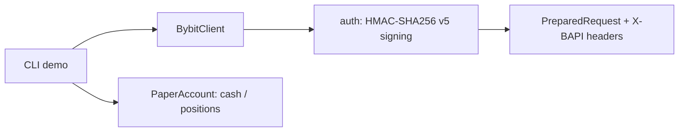

<p align="center">
  
</p>

<h1 align="center">Bybit Trading Bot</h1>

<p align="center">
  <strong>Bybit API trading bot with HMAC-SHA256 v5 authentication and a built-in paper-trading account — in Python.</strong><br>
  Sign v5 requests correctly, inspect exactly what would be sent, and rehearse strategies risk-free.
</p>

<p align="center">
  <em>Built and maintained by <a href="https://viprasol.com">Viprasol Tech</a> — Fintech Experts. Full-Stack Builders.</em>
</p>

<p align="center">
  <a href="https://github.com/Viprasol-Tech/bybit-trading-bot/actions/workflows/ci.yml"></a>
  <a href="LICENSE"></a>
  
  <a href="https://t.me/viprasol_help"></a>
  <a href="https://github.com/Viprasol-Tech/bybit-trading-bot/stargazers"></a>
</p>

---

> ## ⚠️ Disclaimer
> This software is for **educational purposes only** and is **not financial advice**. Cryptocurrency trading is highly volatile and involves substantial risk, including the **total loss of capital**. Paper-trading results are **not** indicative of future performance. Always test against the paper account and Bybit testnet first, and comply with Bybit's terms and your local laws. **Use at your own risk** — Viprasol Tech assumes no responsibility for your trading results.

---

## ✨ Features

- 🔐 **Correct Bybit v5 signing** — HMAC-SHA256 over `timestamp + api_key + recv_window + payload`, lowercase hex.
- 📦 **Ready-made auth headers** — builds the exact `X-BAPI-API-KEY`, `X-BAPI-TIMESTAMP`, `X-BAPI-RECV-WINDOW`, `X-BAPI-SIGN` set.
- 🧪 **Inspect before you send** — `BybitClient` prepares fully-signed requests with no network I/O.
- 🏜️ **Paper account included** — `PaperAccount` tracks cash and positions for risk-free buys and sells.
- 🌐 **Mainnet & testnet** — switch base URLs with a single argument.
- 🖥️ **CLI** — `bybit-trading-bot demo` prints signed headers and runs a paper round-trip.
- ⚙️ **Modern tooling** — ruff, mypy (strict), pytest, GitHub Actions CI.

## 🚀 Quickstart

```bash
git clone https://github.com/Viprasol-Tech/bybit-trading-bot.git
cd bybit-trading-bot
python -m pip install -e ".[dev]"

# Show signed v5 headers and run a paper-trading round-trip:
bybit-trading-bot demo
bybit-trading-bot demo --symbol ETHUSDT
```

## 🧩 Sign a request and paper-trade

```python
from bybit_trading_bot.client import BybitClient, TESTNET_BASE_URL
from bybit_trading_bot.paper import PaperAccount

client = BybitClient("api-key", "api-secret", base_url=TESTNET_BASE_URL)
req = client.prepare_post("/v5/order/create", {"symbol": "BTCUSDT", "side": "Buy"})
print(req.headers["X-BAPI-SIGN"])  # lowercase hex HMAC-SHA256

account = PaperAccount(cash=10_000.0)
account.buy("BTCUSDT", 0.1, 30_000.0)
account.sell("BTCUSDT", 0.1, 31_500.0)
print(account.equity({"BTCUSDT": 31_500.0}))  # 10_150.0
```

## 🏗️ Architecture



## 🗺️ Roadmap

- [x] Bybit v5 HMAC-SHA256 signing + auth headers
- [x] Signed-request preparation (GET/POST) without network I/O
- [x] Paper-trading account with buy/sell/equity
- [ ] Live HTTP transport (httpx) for testnet & mainnet
- [ ] Order/position models and WebSocket market data
- [ ] Strategy runner and Telegram alerts

## 🤝 Contributing

PRs welcome — see [CONTRIBUTING.md](CONTRIBUTING.md) and our [Code of Conduct](CODE_OF_CONDUCT.md).

## 📬 Contact — Viprasol Tech Private Limited

- Website: [viprasol.com](https://viprasol.com)
- Email: [support@viprasol.com](mailto:support@viprasol.com)
- Telegram: [t.me/viprasol_help](https://t.me/viprasol_help) | WhatsApp: +91 96336 52112
- GitHub: [@Viprasol-Tech](https://github.com/Viprasol-Tech) | [LinkedIn](https://www.linkedin.com/in/viprasol/) | X [@viprasol](https://twitter.com/viprasol)

> *Viprasol Tech — fintech software, algorithmic trading systems, MT4/MT5 bots, AI voice agents, and B2B SaaS. Need a custom build? [Get in touch](mailto:support@viprasol.com).*

## License

[MIT](LICENSE) (c) 2025 Viprasol Tech Private Limited
