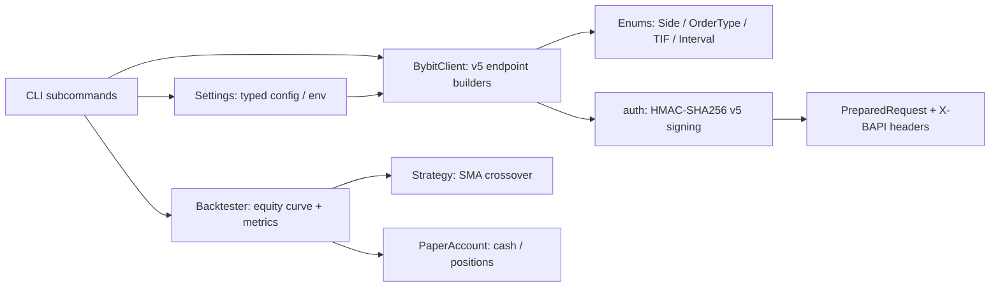

<p align="center">
  
</p>

<h1 align="center">Bybit Trading Bot</h1>

<p align="center">
  <strong>A Python toolkit for the Bybit v5 API: correct HMAC-SHA256 signing, typed order/kline/wallet request builders, a strategy library, and a paper backtester with real metrics.</strong><br>
  Sign v5 requests correctly, inspect exactly what would be sent, and rehearse strategies risk-free.
</p>

<p align="center">
  <em>Built and maintained by <a href="https://viprasol.com">Viprasol Tech</a> — Fintech Experts. Full-Stack Builders.</em>
</p>

<p align="center">
  <a href="https://github.com/Viprasol-Tech/bybit-trading-bot/actions/workflows/ci.yml"></a>
  <a href="LICENSE"></a>
  
  
  
  
  
  <a href="https://t.me/viprasol_help"></a>
  <a href="https://github.com/Viprasol-Tech/bybit-trading-bot/stargazers"></a>
</p>

---

> ## ⚠️ Disclaimer
> This software is for **educational purposes only** and is **not financial advice**. Cryptocurrency trading is highly volatile and involves substantial risk, including the **total loss of capital**. Paper-trading and backtest results are **not** indicative of future performance. Always test against the paper account and Bybit testnet first, and comply with Bybit's terms and your local laws. **Use at your own risk** — Viprasol Tech assumes no responsibility for your trading results.

---

## ✨ Features

- 🔐 **Correct Bybit v5 signing** — HMAC-SHA256 over `timestamp + api_key + recv_window + payload`, lowercase hex.
- 📦 **Ready-made auth headers** — builds the exact `X-BAPI-API-KEY`, `X-BAPI-TIMESTAMP`, `X-BAPI-RECV-WINDOW`, `X-BAPI-SIGN` set.
- 🧱 **Typed v5 endpoint builders** — `get_kline`, `get_tickers`, `get_positions`, `get_wallet_balance`, `place_order`, `cancel_order`.
- 🎚️ **Order types & time-in-force** — market/limit with `GTC` / `IOC` / `FOK` / `PostOnly`, plus `orderLinkId` and `reduceOnly`.
- 🧪 **Inspect before you send** — every call returns a fully-signed `PreparedRequest` with no network I/O.
- 📈 **Strategy library** — an SMA-crossover strategy and a reusable `sma` helper behind a clean `Strategy` protocol.
- 🔬 **Paper backtester** — equity curve plus total return, maximum drawdown, and an annualised Sharpe ratio.
- 🏜️ **Paper account** — `PaperAccount` tracks cash and positions for risk-free buys and sells.
- ⚙️ **Typed config** — `Settings` validates inputs and loads from `BYBIT_*` environment variables.
- 🖥️ **Rich CLI** — `demo`, `order`, `kline`, `balance`, `backtest`, and `version` subcommands.
- 🧰 **Modern tooling** — ruff, mypy (strict), pytest, GitHub Actions CI.

## 🚀 Quickstart

```bash
git clone https://github.com/Viprasol-Tech/bybit-trading-bot.git
cd bybit-trading-bot
python -m pip install -e ".[dev]"

# Show signed v5 headers and run a paper-trading round-trip:
bybit-trading-bot demo --symbol ETHUSDT

# Preview a signed limit order (nothing is sent):
bybit-trading-bot order --order-type Limit --price 30000 --qty 0.01

# Backtest an SMA crossover with metrics:
bybit-trading-bot backtest --fast 10 --slow 30 --bars 300
```

## 🧩 Usage

### Build signed v5 requests

```python
from bybit_trading_bot import BybitClient, Side, OrderType, TimeInForce, Interval
from bybit_trading_bot.client import TESTNET_BASE_URL

client = BybitClient("api-key", "api-secret", base_url=TESTNET_BASE_URL)

# A signed limit order with time-in-force — returns a PreparedRequest, sends nothing.
order = client.place_order(
    "BTCUSDT", Side.BUY, OrderType.LIMIT, "0.01",
    price="30000", time_in_force=TimeInForce.POST_ONLY,
)
print(order.method, order.url)        # POST https://api-testnet.bybit.com/v5/order/create
print(order.headers["X-BAPI-SIGN"])   # lowercase hex HMAC-SHA256
print(order.body)                     # compact signed JSON

# Market data and account reads are just as easy:
candles = client.get_kline("BTCUSDT", Interval.H1, limit=200)
wallet = client.get_wallet_balance(coin="USDT")
```

### Backtest a strategy

```python
from bybit_trading_bot import SmaCrossStrategy, run_backtest

closes = [30_000 + 50 * i for i in range(300)]          # your price series
result = run_backtest(closes, SmaCrossStrategy(10, 30), fee_rate=0.001)

print(f"Return:   {result.total_return:.2%}")
print(f"Drawdown: {result.max_drawdown:.2%}")
print(f"Sharpe:   {result.sharpe():.2f}")
```

### Configure from the environment

```python
from bybit_trading_bot import Settings

settings = Settings.from_env()          # reads BYBIT_API_KEY, BYBIT_TESTNET, ...
client = BybitClient(settings.api_key, settings.api_secret, base_url=settings.base_url)
```

## 🏗️ Architecture



## 📚 API Reference

| Component | Symbol | Purpose |
| --- | --- | --- |
| Auth | `sign`, `auth_headers` | Produce the v5 HMAC-SHA256 signature and `X-BAPI-*` headers. |
| Client | `BybitClient.place_order` | Build a signed `POST /v5/order/create` (market/limit + TIF). |
| Client | `BybitClient.cancel_order` | Build a signed `POST /v5/order/cancel` by id or link id. |
| Client | `BybitClient.get_kline` | Build a signed `GET /v5/market/kline` candle request. |
| Client | `BybitClient.get_tickers` | Build a signed `GET /v5/market/tickers` request. |
| Client | `BybitClient.get_positions` | Build a signed `GET /v5/position/list` request. |
| Client | `BybitClient.get_wallet_balance` | Build a signed `GET /v5/account/wallet-balance` request. |
| Enums | `Side`, `OrderType`, `TimeInForce`, `Category`, `Interval` | Wire-accurate trading enumerations. |
| Strategy | `SmaCrossStrategy`, `sma` | Fast/slow SMA crossover signals. |
| Backtest | `run_backtest`, `BacktestResult` | Simulate signals and compute return / drawdown / Sharpe. |
| Paper | `PaperAccount` | Cash-and-positions sandbox with buy/sell/equity. |
| Config | `Settings` | Validated config with `BYBIT_*` env loading. |

## 🗺️ Roadmap

- [x] Bybit v5 HMAC-SHA256 signing + auth headers
- [x] Signed-request preparation (GET/POST) without network I/O
- [x] High-level v5 builders (kline, tickers, positions, wallet, order, cancel)
- [x] Order types + time-in-force (GTC/IOC/FOK/PostOnly)
- [x] Paper-trading account with buy/sell/equity
- [x] SMA-crossover strategy + paper backtester with metrics
- [x] Typed config with environment loading
- [ ] Live HTTP transport (httpx) for testnet & mainnet
- [ ] WebSocket market data and order/position streams
- [ ] More strategies (RSI, breakout) and Telegram alerts

## ❓ FAQ

**Does this place real orders?** No. Every builder returns a `PreparedRequest` and the CLI never makes network calls — you choose if and how to send them.

**Where do my API keys go?** Nowhere by default. Pass them explicitly or via `BYBIT_*` env vars; nothing is persisted or transmitted by this library.

**Testnet or mainnet?** Both. Use `Settings(testnet=True)` or `TESTNET_BASE_URL`; mainnet is the default.

**Are backtest results realistic?** They are a deterministic, fee-aware simulation for learning — not a promise of live performance. Always paper-trade first.

## 🤝 Contributing

PRs welcome — see [CONTRIBUTING.md](CONTRIBUTING.md) and our [Code of Conduct](CODE_OF_CONDUCT.md). Run `ruff check .`, `mypy src`, and `pytest` before opening a PR.

## Contact — Viprasol Tech Private Limited

- Website: [viprasol.com](https://viprasol.com)
- Email: [support@viprasol.com](mailto:support@viprasol.com)
- Telegram: [t.me/viprasol_help](https://t.me/viprasol_help) | WhatsApp: +91 96336 52112
- GitHub: [@Viprasol-Tech](https://github.com/Viprasol-Tech) | [LinkedIn](https://www.linkedin.com/in/viprasol/) | X [@viprasol](https://twitter.com/viprasol)

## License

[MIT](LICENSE) (c) 2025 Viprasol Tech Private Limited
